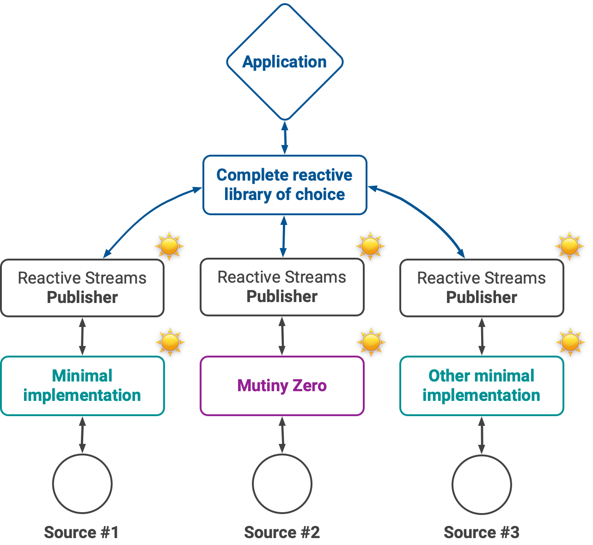

# Overview

Mutiny Zero is a minimal API for creating [reactive streams](https://www.reactive-streams.org) compliant publishers.

It weights less than 50K and has 0 external dependency beyond the _reactive streams_ API (or [Java Flow](https://docs.oracle.com/en/java/javase/11/docs/api/java.base/java/util/concurrent/Flow.html)).

## What are reactive streams?

From the [reactive streams website](https://www.reactive-streams.org):

> Reactive Streams is an initiative to provide a standard for asynchronous stream processing with non-blocking back pressure.

**Reactive streams are the _lingua franca_ for an open and vendor-neutral asynchronous programming ecosystem in Java.**

In a _reactive streams_ ecosystem _sources_ with asynchronous I/O can be wrapped as _publishers_, and applications can _subscribe_ to these publishers:

Since reactive streams are defined as a set of minimal interfaces (see the [Java Flow interfaces](https://docs.oracle.com/en/java/javase/11/docs/api/java.base/java/util/concurrent/Flow.html)), it is possible to mix and match publishers, processors and subscribers from different software stacks.
For instance an event streaming service and a large data store can expose reactive streams compliant clients.
In turn applications can be made end-to-end reactive as long as the code honors reactive streams protocols and semantics.

Reactive streams is a low-level protocol and applications shall use higher-level reactive programming libraries such as [Mutiny](https://smallrye.io/smallrye-mutiny/).

## Why is Mutiny Zero any needed?

The reactive streams interfaces are quite simple, so where is the catch?

### It's all about the protocol!

In a perfect world middleware and service vendors would _simply_ implement these interfaces and ship client libraries.
**The problem with reactive streams is not the interfaces: the protocol is the hard part.**

[Reactive streams come with a specification](https://github.com/reactive-streams/reactive-streams-jvm/blob/v1.0.3/README.md#specification) and a [TCK to check for publishers, processors and subscribers conformance](https://github.com/reactive-streams/reactive-streams-jvm/tree/v1.0.3/tck).
There are many subtle rules that the TCK verifies, and it can be surprisingly hard to respect all of them.

Of course one may be tempted to just ignore some rules and just focus on the Java interfaces, but then combining reactive bits will likely break at runtime due to back-pressure and/or threading problems.

### Why does it matter to keep the ecosystem open and vendor-neutral?

Developing reactive streams compliant libraries is difficult, so vendors have been tempted to _simply_ reuse a high-level reactive programming library.

All of these libraries have ways to create publishers from different eventing models, and because they are _supposed_ to pass the reactive streams TCK then the resulting publishers shall also be compliant.
This is a technically correct yet a poor answer in our opinion.

We dived into the code of several reactive streams client libraries, and we found out that more often than not they had become tightly-coupled to the peculiarities of certain reactive programming libraries.

This is a major problem because strong adherence to a complete reactive programming library annihilates the benefits of the reactive streams specification:

* applications may want to use a different reactive programming library than the one chosen by a vendor, bringing unwanted dependencies (who needs 3 reactive programming libraries in their code base?), 
* vendors become bound to the release cycle of the chosen reactive programming library,
* conflicts between versions are more likely to happen because different vendors may depend on incompatible versions of a given reactive programming library.

## The promise of Mutiny Zero

The mission of _Mutiny Zero_ is to provide a minimal library for implementing reactive streams compliant publishers.

Mutiny Zero does not want to be a complete reactive programming library for Java, so you will only find APIs and helpers deemed useful to write publishers.
Nothing else, nothing more.

Application developers must be free to choose their reactive stacks and not be imposed opinionated choices by vendors! 
